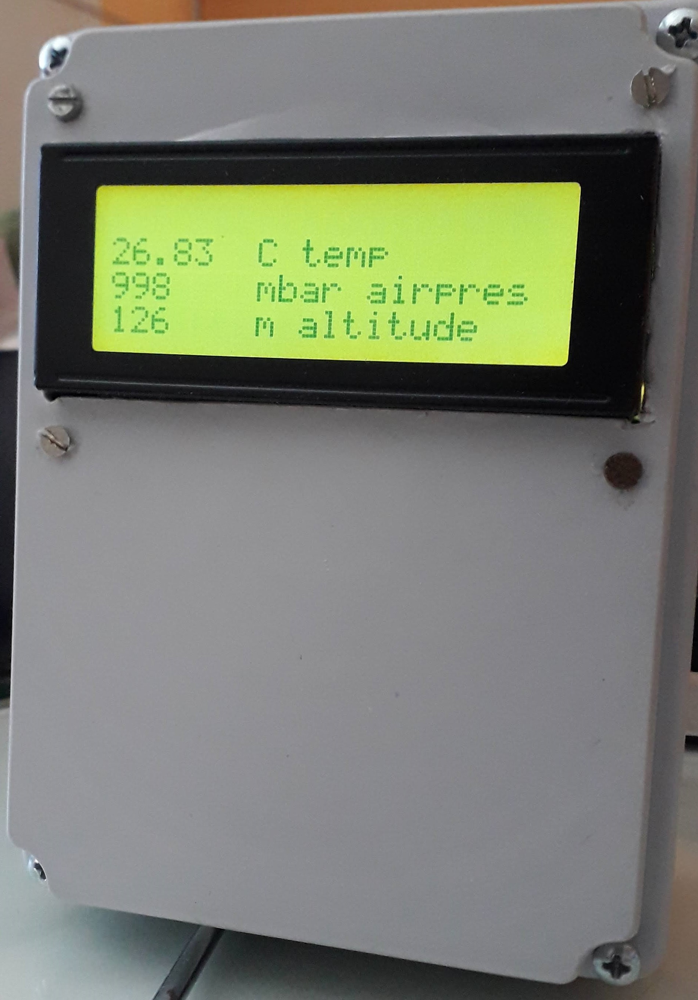
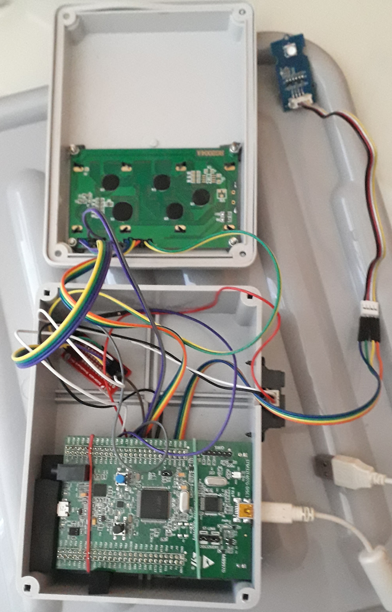

# STM32_RandomDisplayer

Show air pressure, temperature and altitude on LCD display, when triggered by distance sensor.

## About

My first electronics project - get to know STM32, its components and connectivity with different sensors (and to use STM32 board, which was laying in my drawer for a couple of years, to do something kinda useful).

Hardware used:
* STM32F407
* IR distance measuring unit ([Sharp datasheet](https://global.sharp/products/device/lineup/data/pdf/datasheet/gp2y0a21yk_e.pdf))
* Barometer ([original code](https://github.com/Seeed-Studio/Grove_Barometer_HP20x), [SeeedStudios datasheet](https://raw.githubusercontent.com/SeeedDocument/Grove-Barometer-High-Accuracy/master/res/HP206C_Datasheet.pdf))
* LCD2004 display screen 5V ([lcd library](https://github.com/4ilo/HD44780-Stm32HAL), [datasheet](https://4.imimg.com/data4/BI/XG/MY-1833510/lcd-with-blue-back-light-20x4.pdf))

### IR distance measuring unit
ADC input, 5V

### Barometer
I2C connection, 3V

I kinda translated the [existing library](https://github.com/Seeed-Studio/Grove_Barometer_HP20x) written in C++ to C, to work with my STM32 unit.

### LCD display

The existing [library from 4ilo](https://github.com/4ilo/HD44780-Stm32HAL) works perfectly for this 4 line LCD display.

### Rest

For the pins setup and STM32 connections, STM32CubeIDE / STM32CubeMX was used which takes care of the most stuff using HAL library.

